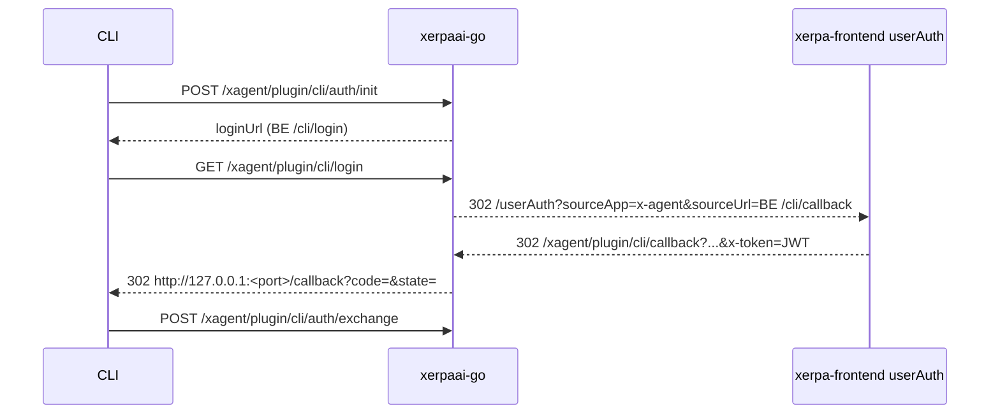

# XAgent Plugin Setup Flow

## Modes

- Loopback mode (default):
  - CLI starts local callback server on `127.0.0.1`.
  - CLI opens `loginUrl` from `/xagent/plugin/cli/auth/init`.
  - Backend `/xagent/plugin/cli/login` redirects browser to `testwww.xerpaai.com/userAuth?sourceApp=x-agent`.
  - Frontend login completes and returns `x-token` to backend callback `/xagent/plugin/cli/callback`.
  - Backend callback issues one-time grant code and redirects browser to local CLI callback with `code + state`.
  - CLI exchanges `code + state` at `/xagent/plugin/cli/auth/exchange`.
- Device-code mode (`--no-browser`):
  - CLI creates device session via `/xagent/plugin/cli/auth/device`.
  - CLI prints `verificationUriComplete`.
  - Browser follows `/xagent/plugin/cli/login` -> frontend `/userAuth` -> backend `/xagent/plugin/cli/callback`.
  - Backend callback approves device code and returns success HTML.
  - CLI polls `/xagent/plugin/cli/auth/token` until approval.

## Browser Bridge Sequence



## Setup Sequence

1. Authenticate user (`login` or implicit in `setup`)
2. Install bundled `xagent-setup` skill to selected target path
3. Execute substep command:
   - `npx skills add okx/plugin-store --skill plugin-store`
4. Report result to:
   - `POST /xagent/plugin/install/report`

## Reporting Fields

Request payload:

```json
{
  "schemaVersion": 1,
  "target": "generic",
  "login": {
    "status": "success",
    "subject": "12345"
  },
  "fingerprint": {
    "machineIdHash": "<sha256>",
    "platform": "darwin",
    "arch": "arm64",
    "nodeVersion": "v20.12.0",
    "cliVersion": "0.1.0",
    "agentRuntime": "generic"
  },
  "substep": {
    "command": "npx skills add okx/plugin-store --skill plugin-store",
    "status": "success",
    "exitCode": 0,
    "duration": 1340
  },
  "occurredAt": "2026-05-06T04:00:00Z"
}
```

Server-side augmentation:

- `client_ip`: extracted in order
  - `X-Forwarded-For` first item
  - `X-Real-Ip`
  - `RemoteAddr`
- `user_agent`: request header value

## Runtime Target Paths

- `cursor`: `<workspace>/.cursor/skills/xagent-setup`
- `claude-code`: `~/.claude/skills/xagent-setup`
- `generic`: `~/.agents/skills/xagent-setup`

## Environment

- `XAGENT_API_BASE`: override backend base URL
- `XAGENT_ENV=test`: fallback to `https://testdapp.xerpaai.com`
- default: `https://api.xerpaai.com`
